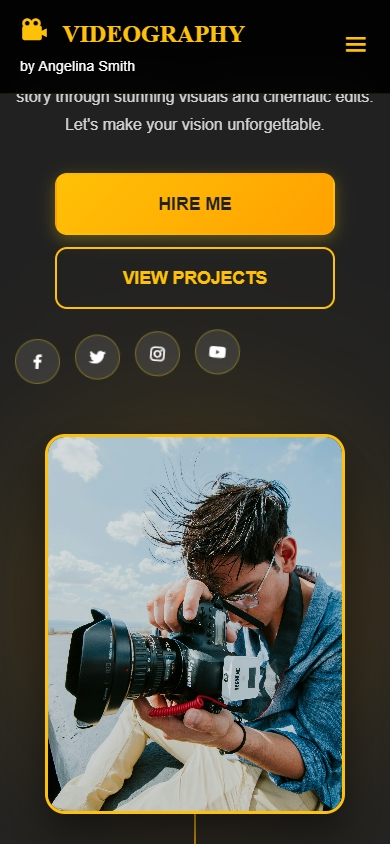
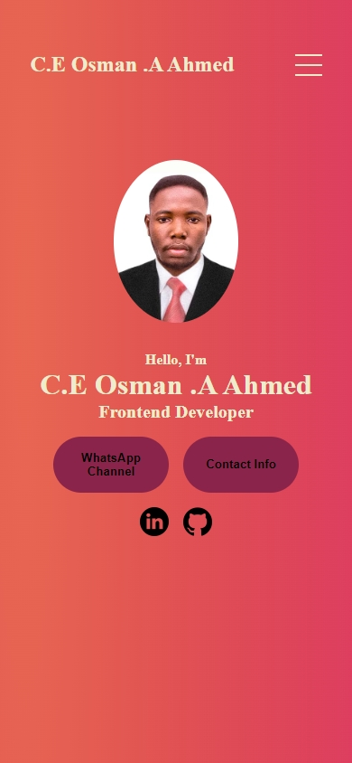

# 🎥 Video Grapher Website

A modern and responsive portfolio website designed for **videographers and content creators** to showcase their video projects, services, and personal brand.

---

## 📸 Screenshots

### 🏠 Homepage

### 🎬 Portfolio Section

## 🚀 Features

- 🎥 Professional video portfolio layout
- 📱 Fully responsive (mobile & desktop)
- ⚡ Fast loading & lightweight
- 🎨 Clean and modern UI
- 🧩 Easy to customize and extend

---

## 🛠️ Tech Stack

- **HTML5**
- **CSS3**
- **Vanilla JavaScript**

No frameworks. No dependencies. Pure web technologies.

---

## 📂 Project Structure

Video-Grapher-Website/
├── assets/
│ ├── images/
│ ├── videos/
│ └── icons/
├── screenshots/
│ ├── home.png
│ └── portfolio.png
├── index.html
├── style.css
├── script.js
└── README.md
